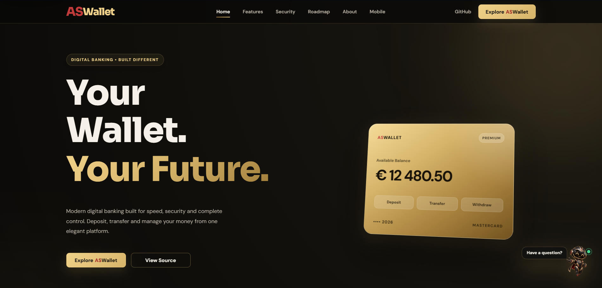

    ASWallet Website

    Your Wallet. Your Future.

    Modern digital banking presentation and interactive product demo for ASWallet.

  

---

Overview

ASWallet Website is the official presentation site and interactive frontend demo for the ASWallet digital wallet ecosystem. It introduces the product vision, features, security principles and development roadmap while allowing visitors to explore a simulated wallet experience without registration or real financial data.

The project is built with semantic HTML, modular CSS and vanilla JavaScript. It uses no frontend framework and no backend connection—the demo state exists only in the browser and resets after a page refresh.

Highlights

Premium black, graphite and champagne-gold visual identity

Responsive landing page with animated sections

Interactive wallet Dashboard with hide/show balance control

Spending overview, category breakdown and recent transactions

Three-step money transfer flow: Recipient → Details → Review

Live transfer preview, amount validation and confirmation state

Shared in-memory balance and transaction state

Modern transaction timeline grouped by date

Search and Incoming / Outgoing / Pending filters

Transaction details drawer with keyboard support

Print-ready ASWallet Demo Statement export via browser PDF printing

Accessible navigation, focus handling and reduced-motion support

Custom domain deployment at aswallet.eu

Interactive Demo

The demo provides a safe, UI-only product experience:

Area

Available functionality

Dashboard

Balance card, privacy toggle, spending overview, quick actions and recent transactions

Transfer

Recipient selection, custom recipient, amount presets, validation, live preview, review and success flow

Transactions

Summary cards, timeline, search, filters and transaction details drawer

PDF Statement

Current balance, money in/out, net flow and full transaction history in a print-ready report

[!IMPORTANT]The demo uses simulated data only. No account is created, no real financial information is collected and no money is transferred.

Website Sections

Hero — product introduction and direct access to the demo

Features — essential ASWallet capabilities

Security — security-focused product principles

Roadmap — development direction and planned milestones

About — the vision behind ASWallet

Call to Action — entry point to the interactive experience

Footer — product navigation and system status

Technology Stack

---

Technology

Purpose

HTML5

Semantic page and demo structure

CSS3

Modular responsive layout, visual system and animations

JavaScript ES Modules

Navigation, demo state, transfers, filters, drawer and PDF printing

GitHub Pages

Static deployment

---

Custom Domain

aswallet.eu

---

Project Structure

ASWallet-Website/
├── css/
│   ├── base/
│   ├── components/
│   ├── demo/
│   │   ├── demo-actions.css
│   │   ├── demo-dashboard.css
│   │   ├── demo-history.css
│   │   ├── demo-modal.css
│   │   ├── demo-responsive.css
│   │   ├── demo-shell.css
│   │   ├── demo-transactions.css
│   │   └── demo-transfer.css
│   ├── layout/
│   └── sections/
├── demo/
│   └── index.html
├── js/
│   ├── demo/
│   │   └── demo.js
│   ├── app.js
│   ├── nav.js
│   └── section modules
├── pages/
├── assets/
│   └── images/
├── CNAME
├── LICENSE
├── README.md
└── index.html

---

Run Locally

Clone the repository:
git clone https://github.com/AStoyan0ff/ASWallet-Website.git

---

Start a local static server. For example, with VS Code Live Server, open index.html and choose Open with Live Server.

You can also use Python:

python -m http.server 5500

---

Then open:
http://localhost:5500/

A local server is recommended because the project uses JavaScript ES modules.

---

Roadmap

Marketing landing page
Responsive navigation and animated sections
Interactive Wallet Dashboard
Transfer Flow connected to shared demo state
Transaction history, search and filters
Transaction details drawer
PDF statement export
Deposit / Withdraw interactive flow
Reports dashboard
Demo settings experience
Mobile application showcase
Related Repositories

ASWallet-Vol.2 — main Java and Spring Boot application

ASWallet-Vol.2-svc — supporting risk assessment service

---

License

This project is proprietary software. Copying, modification, redistribution or commercial use is not permitted without explicit written permission from the author. See the LICENSE file for details.

---

ASWallet Version 1.0

Made with ❤️ by Andrey Stoyanov (#AStoyanoff)

Powered by coffee ☕, and persistence 💪

ASWallet has not said its last word.

